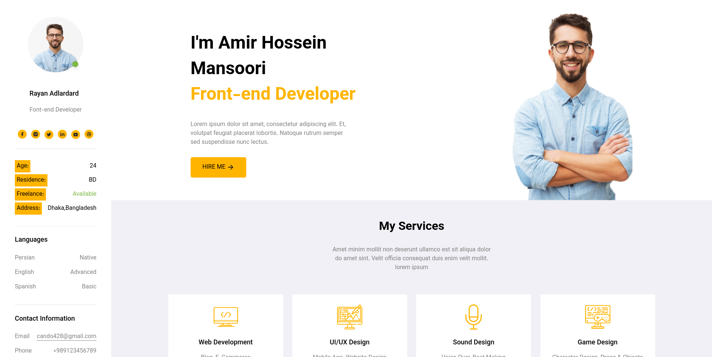

# A Single-page CV website sample



This is a single-page HTML document that can be filled in to serve as a CV website. Only (compiled) CSS is used to style the page.

The design can be found in this [Figma Project](https://www.figma.com/file/NuI6oYxDA9LoGibQ9F5XcX/portfolio-template-(Copy)?node-id=0%3A1&t=ShvG8E7UxMd2n2o8-0).

## Getting started
To build this project, you need [Sass](https://sass-lang.com/).

Clone this repository.
```sh
git clone https://github.com/mans82/IE_HW1
cd IE_HW1
```

Compile the SCSS styles to CSS.
```sh
sass style.scss style.css
```

Now you can open `index.html` file directly in your favourite browser to see the website. Another option is to run a web server to serve the files. If you have Python installed, one option is to use  `http.server` module provided by the Python standard library:

```sh
python -m http.server --bind localhost 8080
```

After that, opening [localhost:8080](http://localhost:8080) in your browser will open the website.